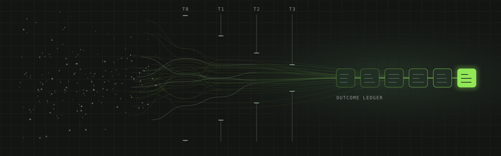
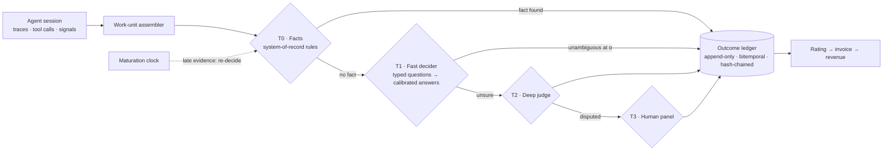

<p align="center">
  
</p>

<h1 align="center">Outcome Adjudication</h1>

<p align="center"><b>Paying for outcomes is an adjudication problem, not a metering problem.</b><br>
An open specification and research program for deciding, auditably, whether an AI agent's work counted as a billable outcome.</p>

<p align="center">
  
  
  
  
  
</p>

<p align="center">
  <a href="docs/rfc/0001-outcome-adjudication.md">Read the RFC</a> ·
  <a href="docs/concepts.md">Concepts</a> ·
  <a href="spec/">Spec</a> ·
  <a href="experiment/PREREGISTRATION.md">Pre-registration</a> ·
  <a href="ROADMAP.md">Roadmap</a> ·
  <a href="CONTRIBUTING.md">Contribute</a>
</p>

---

## The problem

Outcome-based pricing for AI agents is everywhere in pitch decks and almost nowhere in contracts. Today's meters mostly count a proxy for success (24 to 72 hours of silence, an LLM skimming a transcript) and the party that gets paid runs the meter, the judge and the dial.

Older industries that pay for outcomes (energy savings, healthcare shared savings, pay-for-success bonds) learned the same lesson: **agree how success is decided before money moves, and let someone other than the payee apply it.** This project brings that discipline to AI agents.

## The idea in one diagram



Every session is judged against a **success specification** compiled from the planned task. **Facts come before opinions.** A **pinned, calibrated decider** becomes the contract's definition of an outcome. Every decision lands in an **outcome ledger**, and the billing error rate is a contracted, measured number: the **overbilling bound α**.

## Core concepts

| Term | Meaning |
| --- | --- |
| [Adjudication layer](docs/concepts.md#adjudication-layer) | The part of a billing system that decides whether a unit of agent work counts as a billable outcome, and records why. |
| [Work unit](docs/concepts.md#work-unit) | The billable subject: one piece of intended work, stitched across sessions, channels and identities. |
| [Success specification](docs/concepts.md#success-specification) | A structured definition of an intended outcome, compiled from the planned task before it runs: goals, predicates, judged criteria, constraints, integrity checks and matured criteria. |
| [Success Spec Compiler](docs/concepts.md#success-spec-compiler) | The design-time step that turns a task's prompts, instructions and tools into a success specification, and flags criteria that independent compilers disagree on. |
| [Facts before opinions](docs/concepts.md#facts-before-opinions) | System-of-record evidence (CI results, a merge or revert, a refund posted) overrides any model's judgment. |
| [Decision cascade](docs/concepts.md#decision-cascade) | Four tiers: T0 deterministic facts, T1 a fast calibrated decider, T2 a slower reasoning judge, T3 a human panel. |
| [Risk router](docs/concepts.md#risk-router) | Conformal prediction applied to the T1 output: a decision is accepted only when its answer set is unambiguous at the contracted error rate. |
| [Overbilling bound (α)](docs/concepts.md#overbilling-bound) | The contracted upper bound on expected overbilling among decisions accepted without escalation. |
| [Auto-decidable fraction, ADF(α)](docs/concepts.md#auto-decidable-fraction) | The share of work units decided at T0 or T1 while expected overbilling stays at or below α. |
| [Definition-as-model](docs/concepts.md#definition-as-model) | The model decides every case, but the decision function (the decider bundle) is pinned for a contract period and becomes the contract's definition of an outcome. |

Full vocabulary: [docs/concepts.md](docs/concepts.md).

## What a success spec looks like

```yaml
# Worked example from section 9 of the article.
spec_version: coding-bugfix-v1
task_class: bugfix
planned_task: >
  Fix the bug described in issue #123 without changing the public API,
  and add a regression test.
goals:
  - {id: g1, description: The reported bug is fixed, mandatory: true, weight: 0.6}
  - {id: g2, description: A regression test guards the fix, mandatory: true, weight: 0.3}
  - {id: g3, description: The public API is unchanged, mandatory: true, weight: 0.1}
predicates:
  - {id: p1, goal: g2, check: new test fails on base commit and passes on head, evidence_source: evaluator sandbox, run_by: evaluator}
  - {id: p2, goal: g1, check: existing test suite passes, evidence_source: evaluator sandbox, run_by: evaluator}
  - {id: p3, goal: g3, check: public API surface unchanged, evidence_source: static analysis of diff, run_by: evaluator}
judged_criteria:
  - {id: j1, goal: g1, question: "Does the change address the root cause rather than the symptom?", answer_type: yes_no, threshold: 0.8}
constraints:
  - {id: c1, check: no existing tests deleted or assertions weakened, decided_by: [tier_0, tier_1]}
integrity_checks:
  - {id: i1, check: "no hardcoding of the issue's specific inputs", decided_by: [tier_1, tier_2]}
matured_criteria:
  - {id: m1, check: change not reverted, window: P14D}
  - {id: m2, check: no incident linked to the change, window: P14D}
```

Validate the spec and examples locally:

```bash
pip install jsonschema pyyaml
python tools/validate.py
```

## Pre-registered predictions

We publish what would prove us wrong before running the experiment. Thresholds freeze before data collection; results ship as v0.2, including every negative result.

| ID | Prediction | Falsified if |
| --- | --- | --- |
| H1 | Evaluators with independent read access to the end state beat transcript-only evaluators on precision at equal recall | Transcript-only evaluators match them |
| H2 | Per-tenant recalibration lowers calibration error for every fast-decider candidate | Any candidate's calibration error does not fall |
| H3 | Rules alone underbill, judges alone overbill, and the cascade beats both | Either single method matches the cascade |
| H4 | Spec-driven coding tasks reach ADF ≥ 80% at α = 1% | ADF below 80% |
| H5 | Open-ended drafting tasks stay at ADF ≤ 40% at the same α | ADF above 40% |
| H6 | Integrity checks flag ≥ 90% of passed impossible canaries | Fewer than 90% flagged |

Protocol: [experiment/PREREGISTRATION.md](experiment/PREREGISTRATION.md).

## What's in this repo

| Path | What it is | Status |
| --- | --- | --- |
| [`docs/rfc/0001-outcome-adjudication.md`](docs/rfc/0001-outcome-adjudication.md) | The full RFC | Open for comment |
| [`docs/concepts.md`](docs/concepts.md) | Defined vocabulary | Draft |
| [`spec/`](spec/) | JSON Schemas for success specs and ledger records, metric definitions, decider interface | Draft |
| [`examples/`](examples/) | Worked specs and ledger records (coding, support) | Validated in CI |
| [`experiment/`](experiment/) | Pre-registration for the v0.2 experiment | Pre-registered |
| [`bench/`](bench/) | Adjudication benchmark: canaries, impossible canaries, ADF curves | Planned |
| [`packages/spec-compiler/`](packages/spec-compiler/) | Planned task → success spec, with ambiguity checks | Design |
| [`packages/decider/`](packages/decider/) | Decider interface and adapters for candidate model classes | Design |
| [`packages/ledger/`](packages/ledger/) | Bitemporal, hash-chained outcome ledger and reconciliation | Design |
| [`docs/prior-art.md`](docs/prior-art.md) | Research and industry precedents | Living |

No implementation code is published yet. The spec comes first, because the definitions are the product: code that implements an unagreed definition just automates the dispute.

## Get involved

We want to be proven wrong early and specifically. The most useful contributions right now:

- **Critique the RFC.** Accountants, auditors, ML evaluation researchers, billing engineers, buyers and agent builders each have a question waiting in the RFC's request for comments.
- **Propose a spec change.** Open an issue with the *spec change* template, then a pull request with a changelog entry.
- **Add prior art.** If someone solved part of this before, we want to cite it.
- **Contribute canary tasks.** Known-outcome and impossible tasks make the v0.2 benchmark stronger.

Prefer private feedback? Email **hello@stigg.io**. Everyone whose input changes the design is credited in the [changelog](CHANGELOG.md).

## For AI agents

Start with [`llms.txt`](llms.txt) for an index of this repository, and [`AGENTS.md`](AGENTS.md) for working conventions.

## Citation

```bibtex
@techreport{sasson2026outcomeadjudication,
  title       = {Paying for Outcomes Is an Adjudication Problem: A Reference Design for Outcome-Based Pricing of AI Agents},
  author      = {Sasson, Dor},
  institution = {Stigg},
  type        = {Request for Comments},
  number      = {RFC 0001, v0.1},
  year        = {2026}
}
```

Machine-readable citation: [`CITATION.cff`](CITATION.cff).

## License

| What | License |
| --- | --- |
| Code: `tools/`, and future code in `packages/` and `bench/` | [GNU AGPL-3.0](LICENSE) |
| Writing and specification: `docs/`, `spec/`, `examples/`, `experiment/`, this README | [CC BY-SA 4.0](LICENSE-DOCS) |

Both are share-alike: improvements to this work stay open, including when the code runs as a hosted service. Copyright © 2026 Stigg.

## Disclosure

Maintained by Dor Sasson at Stigg, which builds billing and monetization infrastructure. The RFC is written to be vendor-neutral and describes no existing product.
